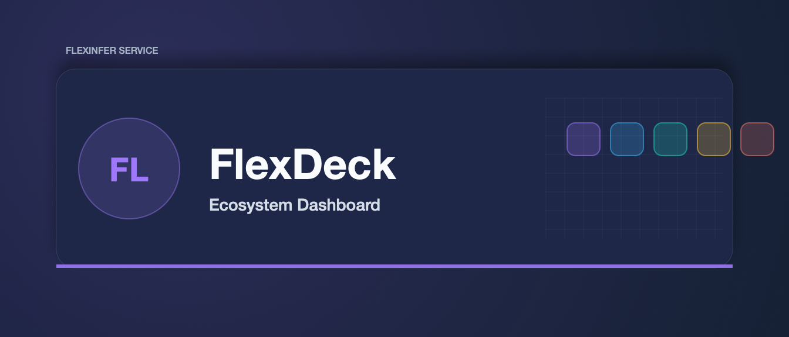

# FlexDeck

Central dashboard for the flexinfer.ai ecosystem — Kubernetes workload management, FlexInfer AI model lifecycle (CRD), GPU metrics, Prometheus/Loki observability, Langfuse tracing, and Flux GitOps.

## Tech Stack

- **Frontend**: SolidJS + Tailwind CSS + Vite
- **Backend**: Go + Chi router + client-go
- **Deployment**: Docker + Kubernetes + Flux GitOps

## Development

### Prerequisites

- Go 1.24+
- Node.js 20+
- Docker (optional)

### Quick Start

```bash
# Install dependencies
make deps

# Run development servers (backend + frontend with hot reload)
make dev
```

Backend runs on `:8080`, frontend dev server on `:5173` (proxies API to backend).

### Individual Commands

```bash
# Backend only
make dev-backend

# Frontend only
make dev-frontend

# Build production
make build

# Run tests
make test
make test-frontend

# Lint
make lint
make lint-frontend
```

## Configuration

Environment variables (source of truth: `internal/config/config.go`):

### Core + auth

| Variable | Default | Description |
|----------|---------|-------------|
| `PORT` | `8080` | Server port |
| `LOG_LEVEL` | `info` | Log level (`debug`, `info`, `warn`, `error`) |
| `STATIC_DIR` | `./web/dist` | Static files directory |
| `UI_CONFIG_DIR` | `/config` | UI config directory mounted in container |
| `WORKSPACE_DIR` | `$HOME/workspace` | Workspace root for local integrations |
| `ALLOWED_ORIGINS` | `*` | Comma-separated CORS allowlist |
| `FLEXDECK_TOKEN` | | Bearer token for API auth |
| `FLEXDECK_TOKEN_COOKIE` | `flexdeck_token` | Auth cookie name |
| `FLEXDECK_TOKEN_COOKIE_MAX_AGE_DAYS` | `30` | Auth cookie TTL in days |
| `FLEXDECK_TOKEN_COOKIE_SECURE` | `false` | Set secure cookie flag |
| `FLEXDECK_TRUSTED_CIDRS` | | Comma-separated client CIDRs granted admin access without a token; trust only ingress-reported LAN ranges |
| `FLEXDECK_TRUSTED_PROXY_CIDRS` | | Comma-separated reverse-proxy CIDRs whose `X-Real-IP`/`X-Forwarded-For` are believed (the ingress). Unset = forwarding headers are never trusted, so the trusted-CIDR bypass only applies to direct connections |

### Kubernetes + observability

| Variable | Default | Description |
|----------|---------|-------------|
| `K8S_DISABLED` | `false` | Disable Kubernetes integration |
| `K8S_READONLY` | `false` | Disable mutating Kubernetes operations |
| `K8S_HOST` | `https://kubernetes.default.svc` | Kubernetes API server |
| `K8S_NAMESPACE` | `default` | Default Kubernetes namespace |
| `K8S_BEARER_TOKEN` | | Kubernetes bearer token |
| `K8S_CA_FILE` | | Kubernetes CA file path |
| `K8S_SKIP_TLS_VERIFY` | `false` | Skip Kubernetes TLS verification |
| `PROM_DISABLED` | `false` | Disable Prometheus integration |
| `PROM_URL` | `http://kube-prometheus-stack-prometheus.monitoring.svc.cluster.local:9090` | Prometheus URL |
| `LOKI_DISABLED` | `false` | Disable Loki integration |
| `LOKI_URL` | `http://loki.logging.svc.cluster.local:3100` | Loki URL |
| `GRAFANA_DISABLED` | `false` | Disable Grafana integration |
| `GRAFANA_URL` | `http://kube-prometheus-stack-grafana.monitoring.svc.cluster.local:80` | Grafana URL |
| `GRAFANA_TOKEN` | | Grafana service-account token |
| `ALERTMANAGER_DISABLED` | `false` | Disable Alertmanager integration |
| `ALERTMANAGER_URL` | `http://kube-prometheus-stack-alertmanager.monitoring.svc.cluster.local:9093` | Alertmanager URL |

### Inference + models

| Variable | Default | Description |
|----------|---------|-------------|
| `VLLM_DISABLED` | `false` | Disable vLLM integration |
| `VLLM_URL` | | vLLM inference URL |
| `VLLM_NAMESPACE` | `ai` | vLLM namespace hint |
| `FLEXINFER_PROXY_DISABLED` | `false` | Disable FlexInfer proxy integration |
| `FLEXINFER_PROXY_URL` | | FlexInfer proxy base URL |
| `MODELS_DISABLED` | `false` | Disable model-management subsystem |
| `MODELS_REGISTRY_PATH` | `/data/models.json` | Model registry JSON file path |
| `MODELS_DOWNLOAD_PATH` | `/models` | Local path for downloaded model artifacts |
| `HF_TOKEN` | | HuggingFace API token |
| `CIVITAI_API_KEY` | | CivitAI API key |
| `GITOPS_REPO_PATH` | | GitOps repo path used for model manifests |
| `AI_NAMESPACE` | `flexinfer-system` | Namespace used for AI workloads |
| `HF_CACHE_PATH` | | HuggingFace cache path |
| `CIVITAI_CACHE_PATH` | | CivitAI cache path |

### Gateways + agents

| Variable | Default | Description |
|----------|---------|-------------|
| `LITELLM_DISABLED` | `false` | Disable LiteLLM integration |
| `LITELLM_URL` | `http://litellm.ai.svc.cluster.local:8000` | LiteLLM gateway URL |
| `LITELLM_API_KEY` | | LiteLLM API key |
| `LITELLM_SCRAPE_INTERVAL` | `15` | LiteLLM metrics scrape interval (seconds) |
| `AGENTS_DISABLED` | `false` | Disable agents subsystem |
| `AGENTS_REGISTRY_PATH` | `/data/agents.json` | Agents registry JSON path |
| `DIFY_URL` | `http://dify-api.ai.svc.cluster.local:5001` | Dify API URL |
| `DIFY_API_KEY` | | Dify API key |
| `LANGGRAPH_URL` | `http://langgraph.ai.svc.cluster.local:8000` | LangGraph API URL |
| `AGENTSCOPE_URL` | `http://agentscope-sandbox-base.ai.svc.cluster.local:8000` | AgentScope API URL |
| `AGENTSCOPE_GUI_URL` | `http://agentscope-sandbox-gui.ai.svc.cluster.local:8000` | AgentScope GUI URL |
| `LOOM_HUD_DISABLED` | `false` | Disable Loom HUD pull/push integrations |
| `LOOM_HUD_URL` | `http://localhost:3333` | Loom HUD pull API base URL used by server-side passthrough |
| `LOOM_HUD_DIRECT_URL` | | Public Loom HUD URL used for direct browser entry |
| `LOOM_HUD_PUSH_TOKEN` | | Shared secret for HUD push webhook auth |

### Data + admin

| Variable | Default | Description |
|----------|---------|-------------|
| `REDIS_DISABLED` | `false` | Disable Redis integration |
| `REDIS_URL` | | Redis URL |
| `REDIS_PASSWORD` | | Redis password |
| `REDIS_DB` | `0` | Redis DB index |
| `LANGFUSE_DISABLED` | `false` | Disable Langfuse integration |
| `LANGFUSE_URL` | `http://langfuse-web.ai.svc.cluster.local:3000` | Langfuse URL |
| `LANGFUSE_PUBLIC_KEY` | | Langfuse public key |
| `LANGFUSE_SECRET_KEY` | | Langfuse secret key |
| `RBAC_DISABLED` | `true` | Disable RBAC subsystem |
| `RBAC_USERS_PATH` | `/data/rbac-users.json` | RBAC user store path |
| `RBAC_ADMIN_TOKEN` | | Bootstrap admin token |
| `AUDIT_DISABLED` | `true` | Disable audit subsystem |
| `AUDIT_TTL_DAYS` | `90` | Audit retention window (days) |
| `MULTICLUSTER_DISABLED` | `true` | Disable multi-cluster subsystem |
| `CLUSTERS_REGISTRY_PATH` | `/data/clusters.json` | Cluster registry store path |
| `GITLAB_URL` | `https://gitlab.com` | GitLab API base URL |
| `GITLAB_TOKEN` | | GitLab API token |

### `/api/health` feature-gate contract

`GET /api/health` returns a `features` map used by frontend navigation and mode gating.

| Feature key | `enabled` when | UI behavior |
|-------------|----------------|-------------|
| `loom_hud` | `LOOM_HUD_DISABLED=false` and `LOOM_HUD_URL` is non-empty | HUD runs in pull mode (`/api/hud/*` for full data) |
| `loom_hud_push` | `LOOM_HUD_DISABLED=false` and push store is configured in server deps | HUD may run push-only fallback (presence snapshots) |
| `rbac` | `RBAC_DISABLED=false` | Admin Users tab and RBAC endpoints available |
| `audit` | `AUDIT_DISABLED=false` | Admin Audit tab and audit endpoints available |
| `multi_cluster` | `MULTICLUSTER_DISABLED=false` | Cluster selector and Admin Clusters tab available |

### `/api/flexinfer/proxy/metrics` contract

`GET /api/flexinfer/proxy/metrics` returns Prometheus-derived proxy metrics as a compatibility-safe payload with additive normalized fields.

Compatibility keys (retained):
- `requests`
- `latency`
- `queue_depth`
- `active_conn`
- `scale_ups`

Normalized additive keys:
- `byModel`
- `totals`
- `requestsByStatus`
- `partial`

`totals` fields:
- `modelCount`
- `requestsTotal`
- `errorsTotal`
- `queueDepth`
- `activeConnections`
- `scaleUps`
- `queueRejectedTotal`
- `queuedRequestsTotal`
- `errorRate`
- `parseErrors`

Notes:
- `byModel` includes per-model `requestsTotal`, `errorsTotal`, `queueDepth`, `activeConnections`, `scaleUps`, `queueRejectedTotal`, and `queuedRequestsTotal`.
- `requestsByStatus` is grouped by model and HTTP status code.
- `partial=true` indicates one or more metrics lines failed to parse; `totals.parseErrors` reports the count.

### `/api/models/crd/{namespace}/{name}/inference` contract

`GET /api/models/crd/{namespace}/{name}/inference` returns a compatibility-safe payload with additive reliability fields.

Core compatibility keys (retained):
- `model`
- `tps`
- `p95LatencyMs`
- `queueDepth`
- `activeConnections`

Additive reliability keys:
- `errorRate`
- `queueWaitP95Ms`
- `rejectedRequestsPerSec`
- `scaleUps5m`
- `activationRetries5m`
- `partial`
- `missingMetrics`

Notes:
- `partial=true` indicates one or more Prometheus queries failed and some fields are defaulted.
- `missingMetrics` lists the internal metric keys that failed to resolve.

### Operator Rollout Checklist (Staging/Prod)

Use this checklist when enabling feature-gated subsystems in non-dev environments.

1. Set the target env vars and deploy.
2. Verify `GET /api/health` reports the expected `features.*.enabled` values.
3. Run the endpoint/UI smoke checks below before promoting.

| Subsystem | Env gates | `/api/health` expectation | Smoke checks |
|-----------|-----------|---------------------------|--------------|
| Loom HUD pull mode | `LOOM_HUD_DISABLED=false`, `LOOM_HUD_URL` set | `features.loom_hud.enabled=true` | `GET /api/hud/presence`, `GET /api/hud/tasks`, `GET /api/hud/workflows`, verify Agents HUD shows pull mode + claims/workflows |
| Loom HUD push fallback | `LOOM_HUD_DISABLED=false`, push store wired in server deps, push payloads arriving | `features.loom_hud_push.enabled=true` | `POST /api/agents/hud/push` with shared token, verify Agents HUD shows push mode presence snapshots |
| RBAC | `RBAC_DISABLED=false` | `features.rbac.enabled=true` | `GET /api/rbac/me`, verify Admin Users tab is visible and user CRUD works |
| Audit | `AUDIT_DISABLED=false` | `features.audit.enabled=true` | `GET /api/audit`, `GET /api/audit/stats`, verify Admin Audit tab data loads |
| Multi-cluster | `MULTICLUSTER_DISABLED=false` | `features.multi_cluster.enabled=true` | `GET /api/clusters`, verify cluster selector and Admin Clusters tab are visible and cluster switch works |

### Upstream Dependency Register

FlexDeck assumes these upstream API/metric families are available for full functionality.

| Dependency surface | Expected upstream contract | Used by |
|--------------------|----------------------------|---------|
| Prometheus HTTP API | `GET /api/v1/query` for instant PromQL execution | `internal/api/handlers/models_inference.go`, `internal/api/handlers/flexinfer_proxy.go` |
| FlexInfer proxy metrics families | `flexinfer_proxy_requests_total`, `flexinfer_proxy_request_duration_seconds_*`, `flexinfer_proxy_queue_depth`, `flexinfer_proxy_active_connections`, `flexinfer_proxy_scale_ups_total`, `flexinfer_proxy_queue_rejected_total`, `flexinfer_proxy_queued_requests_total`, `flexinfer_proxy_queue_wait_duration_seconds_bucket`, `flexinfer_proxy_activation_retries_total` | Inference reliability endpoints and dashboard/model reliability views |
| Loom HUD REST API (pull mode) | `GET /api/presence`, `GET /api/sessions`, `GET /api/tasks`, `GET /api/workflows`, `GET /api/claims`, `GET /api/timeline` plus workflow action routes | `internal/agents/hud.go`, `internal/api/handlers/hud_proxy.go`, Agents HUD UI |
| Loom HUD webhook payload (push mode) | Authenticated `POST /api/agents/hud/push` with presence/session snapshot payload and shared token | `internal/api/handlers/agents.go` (`HUDPresencePush`) + push-store fallback |
| Kubernetes API access | Cluster API reachable with configured auth (`K8S_*`) and CRD access for FlexInfer resources | K8s services views, controller/model operations, events, storage/config viewers |

### HUD Degraded-Mode Thresholds

- Activity feed switches to poll fallback on SSE disconnect and retries with exponential backoff (`2s` base, `30s` max).
- Pull-mode stale warning is shown when successful HUD pull data is older than `45s`.

## Docker

```bash
# Build image
make docker

# Run container
docker run -p 8080:8080 flexdeck:dev
```

## Project Structure

```
flexdeck/
├── cmd/server/          # Go entrypoint
├── internal/
│   ├── agents/          # Agent orchestration
│   ├── api/             # HTTP handlers
│   ├── auth/            # Authentication
│   ├── cache/           # Redis caching layer
│   ├── config/          # Configuration
│   ├── k8s/             # Kubernetes client + FlexInfer CRD
│   ├── litellm/         # LiteLLM gateway proxy
│   ├── metrics/         # Prometheus metrics store + scraper
│   └── models/          # Model management + registry
├── web/
│   ├── src/
│   │   ├── components/  # SolidJS components
│   │   ├── stores/      # State management
│   │   ├── lib/         # Utilities
│   │   └── styles/      # CSS
│   └── ...
├── Dockerfile
├── Makefile
└── .gitlab-ci.yml
```

## License

MIT
<!-- mills-s6-demand-killtest: cross-repo demand path proven 2026-07-06 -->
